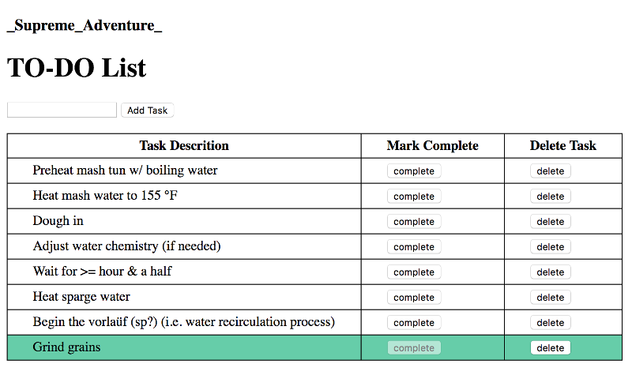

# Supreme Adventure
To-do list web application

## Utilized Web Stack
- `User Interface` - HTML/CSS
- `Client` - JavaScript with jQuery
- `Server` - Node.js with the Express framework
- `Database` - PostgreSQL (pg module)

## Requirements
- Git
- Web browser
- Node and npm
- PostgreSQL command line utility
- PostgreSQL GUI application (e.g. Postico)

## Setup and Run
```bash
# 1. Create PostgreSQL database named 'weekend-to-do-app'
createdb weekend-to-do-app

# 2. Create table "Tasks" using SQL create statement in 'database.sql'. 
# (Optional: initalize database with sample data from 'database.sql')

# 3. Install Node dependencies/libraries using NPM
npm install

# 4. Start the server
npm start

# 5. Application runs locally on PORT 5006
```

**See:** [localhost:5006](http://localhost:5006)

## Version History

- **Version 0.0.0**
Basic CRUD functionality. Allows the user to view all current tasks in the server's database. Add new tasks. Edit a given task to mark as 'completed'. Delete a given task.


- **Version 0.0.1**
Adds some simple CSS styling. I think it's debatable if this version was actually an aesthetic improvement.


- **Version 0.0.2**
Considerable changes to the project's database. The database now logs a creation timestamp for new TODO tasks. Previously the list of current tasks produced by the server came back in arbitrary database order. The list of tasks is now sorted. The currently uncompleted (and more relavant) tasks are listed before completed tasks. The secondary sorting order is oldert to newer based on creation timestamps. I also tried to simplify the SQL queries on the server-side and use better names for database tables and columns. 

- **Version 0.0.3**
Adds a confirmation dialog when the user tries to delete a task. Uses the library [SweetAlert](https://sweetalert.js.org/) to make sweet looking dialogs and error alerts. 

- **Version 0.0.4**
Adds [Bootstrap](https://getbootstrap.com/) to the front end UI and adds some style.
